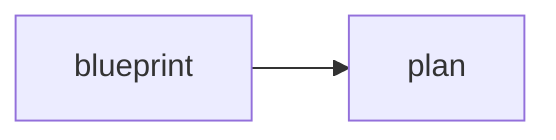
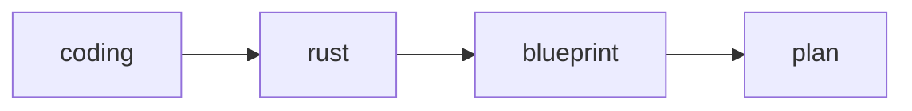

# RFC 0004: Compact Validation and Flowchart Alignment

## 1. Summary

This RFC defines the bounded plan work-surface contract for:

1. a compact `[check]` surface
2. alignment rules between `flowchart.mmd` and `blueprint/` plus `plan/`
3. the default behavior of `qianji show` and `qianji check`

Its goal is simple:

> use as little configuration as possible, minimize redundancy, and let the
> graph plus directory shape carry most of the meaning.

## 2. Minimal Work Surface

Version one recognizes only this minimal structure:

```text
<plan-workdir>/
  qianji.toml
  flowchart.mmd
  blueprint/
  plan/
```

## 3. Minimal `qianji.toml`

Version one should stay close to this shape:

```toml
version = 1

[plan]
name = "name1"
surface = ["flowchart.mmd", "blueprint", "plan"]

[check]
require = ["flowchart.mmd", "blueprint", "plan", "blueprint/**/*.md", "plan/**/*.md"]
flowchart = ["blueprint", "plan"]
```

This is enough for version one.

It contains:

1. the active plan name
2. the visible surfaces for `show`
3. the structural and alignment checks

It does not introduce a query DSL, a separate `plan-track` command surface, or
per-path validation repetition.

## 4. Why Use a Compact `[check]` Surface

The more verbose shape:

```toml
[[validation]]
path = "flowchart.mmd"
kind = "file"
required = true

[[validation]]
path = "blueprint"
kind = "dir"
required = true

[[validation]]
path = "plan"
kind = "dir"
required = true

[[validation]]
path = "blueprint/**/*.md"
kind = "glob"
min_matches = 1

[[validation]]
path = "plan/**/*.md"
kind = "glob"
min_matches = 1
```

A compact `[check]` surface is preferable to a repeated `[[validation]]` form
for the bounded work surface
because the checks naturally group by surface rather than by one path at a
time.

The checks naturally group into:

1. existence checks
2. glob-matching checks
3. flowchart-alignment checks

Version one should express those groups directly instead of repeating one block
per path.

## 5. Compact `[check]` Semantics

### 5.1 `[plan].surface`

Semantics:

1. it defines what `qianji show` exposes
2. version one should include `flowchart.mmd`, `blueprint`, and `plan`

Example:

```toml
[plan]
name = "name1"
surface = ["flowchart.mmd", "blueprint", "plan"]
```

### 5.2 `[check].require`

Semantics:

1. exact paths must exist
2. glob paths must match at least one file
3. version one uses one compact list rather than multiple blocks

```toml
[check]
require = ["flowchart.mmd", "blueprint", "plan", "blueprint/**/*.md", "plan/**/*.md"]
```

This means:

1. `flowchart.mmd` must exist
2. `blueprint/` must exist
3. `plan/` must exist
4. `blueprint/` must contain at least one markdown file
5. `plan/` must contain at least one markdown file

### 5.3 `[check].flowchart`

Semantics:

1. `flowchart.mmd` must exist
2. the flowchart must expose the declared top-level surfaces
3. the visible flowchart backbone must not conflict with the local contract

Example:

```toml
[check]
flowchart = ["blueprint", "plan"]
```

## 6. Minimum `flowchart_alignment` Rules

Version one should stay light. It only needs four checks.

### 6.1 File Presence

`flowchart.mmd` must exist.

### 6.2 Surface Visibility

The flowchart must visibly contain:

1. `blueprint`
2. `plan`

### 6.3 Backbone Visibility

The flowchart must make the backbone relationship between `blueprint` and
`plan` visible.

For example:



or a richer upstream graph such as:



### 6.4 No Obvious Conflict

If the visible flowchart backbone clearly conflicts with the bounded contract,
`qianji check` must fail.

## 7. `qianji show`

`qianji show` does not need extra surface arguments when the work-surface
contract already declares:

```toml
[plan]
surface = ["flowchart.mmd", "blueprint", "plan"]
```

The default command is therefore:

```bash
qianji show --dir <plan-workdir>
```

### Version-One Default Behavior

It should:

1. show `flowchart.mmd`
2. show the top-level structure of `blueprint/`
3. show the top-level structure of `plan/`
4. avoid recursive content expansion
5. avoid retrieval

If future revisions need explicit surface overrides, they should be defined in
a later RFC.

## 8. `qianji check`

Likewise, `qianji check` does not need an explicit `flowchart.mmd` argument.

The default command is:

```bash
qianji check --dir <plan-workdir>
```

It should automatically execute the local `[check]` contract from
`qianji.toml`.

### Version-One Required Checks

It must execute:

1. `require`
2. `flowchart`

It must also include the `plan-track`-derived checks for:

1. boundary
2. drift
3. status legality

`plan-track` is therefore not a separate command surface. It is part of
`qianji check`.

## 9. Recommended Codex Loop

Version one should recommend this loop:

```text
1. qianji show --dir <plan-workdir>
2. Codex inspects filenames and directory shape
3. if needed, Codex decides whether to use tree
4. deeper content retrieval is always done through wendao sql
5. Codex edits only inside <plan-workdir>
6. qianji check --dir <plan-workdir>
7. Codex reads precise diagnostics
8. continue
```

Three distinctions matter here:

1. `tree` only helps decide whether deeper inspection is necessary
2. retrieval always uses Wendao SQL
3. `qianji` does not own a retrieval DSL

## 10. Wendao SQL Remains Simple

The RFC does not put retrieval back into `qianji.toml`.

The retrieval surface remains:

```bash
wendao sql "select path, skeleton from markdown where path like 'blueprint/%'"
wendao sql "select path, skeleton from markdown where path like 'plan/%'"
```

If future work needs richer filters, joins, or aggregations, it should keep
using SQL rather than introducing another query language.

## 11. Rejections

This RFC explicitly rejects:

1. long one-path-per-`[[validation]]` repetition
2. `[query]` or `[[query.lane]]`
3. a Qianji-native retrieval DSL
4. `tasks.md`
5. `qianji plan init`
6. a separate `plan-track` subcommand

## 12. Conclusion

Version one bounded-plan contracts should stay compact:

1. `flowchart.mmd` exposes the graph
2. `blueprint/` and `plan/` expose the primary surfaces
3. a compact `[check]` surface declares the checks
4. `qianji show` and `qianji check` remain the only primary commands
5. Wendao SQL remains the only retrieval surface

This is already stable enough for a demo-level implementation base.
